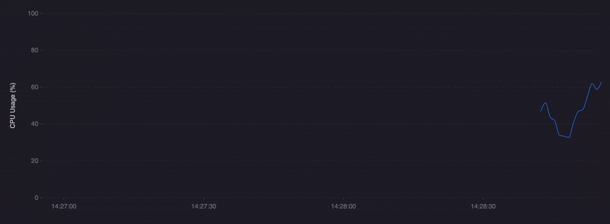
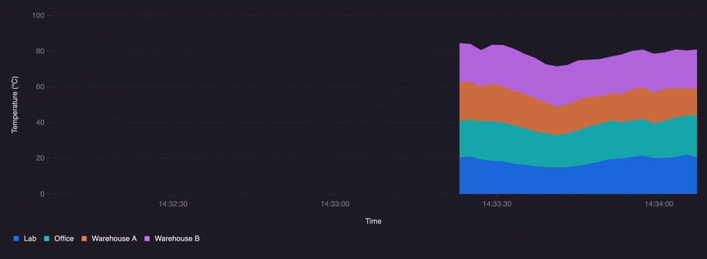
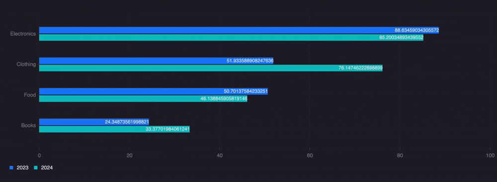
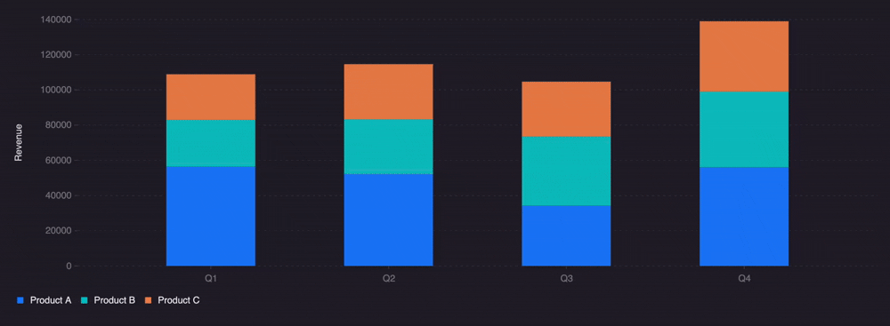
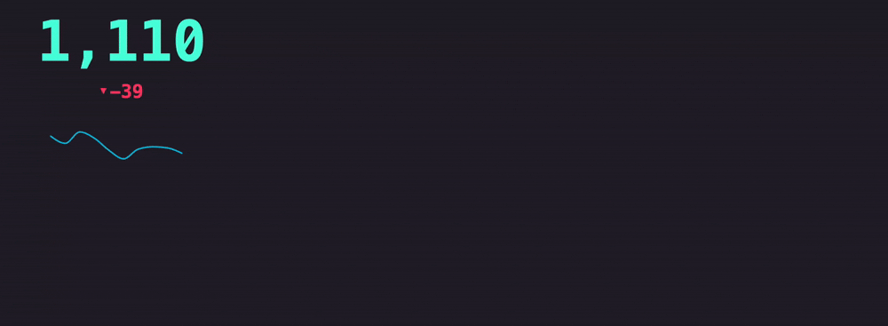
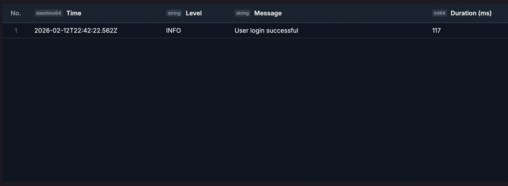
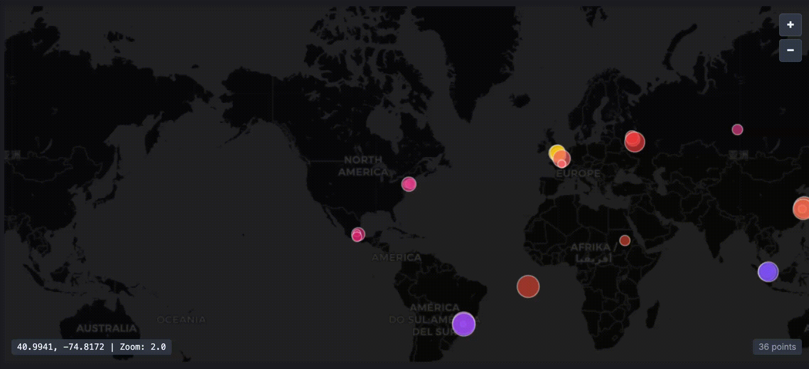

[](https://www.npmjs.com/package/@timeplus/vistral)
[](https://github.com/timeplus-io/vistral/blob/main/LICENSE)

<p align="center">
  
</p>

A powerful streaming data visualization library based on the Grammar of Graphics. Designed for real-time data visualization with support for time series, bar/column charts, single value metrics, and data tables.


# Examples and Playground

https://timeplus-io.github.io/vistral/ 

## Table of Contents

- [Features](#features)
- [Installation](#installation)
- [Quick Start](#quick-start)
- [Chart Types](#chart-types)
  - [Line Chart](#line-chart)
  - [Area Chart](#area-chart)
  - [Bar Chart](#bar-chart-horizontal)
  - [Column Chart](#column-chart-vertical)
  - [Single Value](#single-value)
  - [Data Table](#data-table)
  - [Geo Chart](#geo-chart)
- [Temporal Binding Modes](#temporal-binding-modes)
- [Using Individual Chart Components](#using-individual-chart-components)
- [Data Format](#data-format)
- [Streaming Data with Hooks](#streaming-data-with-hooks)
- [Color Palettes](#color-palettes)
- [API Reference](./docs/api-reference.md)
- [Development](#development)
- [Browser Support](#browser-support)
- [License](#license)

## Features

- 📊 **Multiple Chart Types**: Line, Area, Bar, Column, Single Value, Data Table, and Geo Map
- 🔄 **Streaming Support**: Built for real-time data with efficient updates
- ⏱️ **Temporal Binding**: Three modes for handling streaming data (axis-bound, frame-bound, key-bound)
- 🎨 **Beautiful Themes**: Dark and light themes with customizable color palettes
- 📱 **Responsive**: Auto-fit to container with resize detection
- 🎯 **TypeScript**: Full TypeScript support with comprehensive types
- ⚡ **Performant**: Optimized for streaming data with minimal re-renders
- 🧩 **Modular**: Use the unified `StreamChart` or individual chart components

## Installation

```bash
npm install @timeplus/vistral

# or with yarn
yarn add @timeplus/vistral

# or with pnpm
pnpm add @timeplus/vistral
```

### Peer Dependencies

Make sure you have React installed:

```bash
npm install react react-dom
```

## Quick Start

```tsx
import { StreamChart } from '@timeplus/vistral';

function App() {
  const data = {
    columns: [
      { name: 'timestamp', type: 'datetime64' },
      { name: 'value', type: 'float64' },
      { name: 'category', type: 'string' },
    ],
    data: [
      ['2024-01-01T10:00:00Z', 42.5, 'A'],
      ['2024-01-01T10:01:00Z', 45.2, 'A'],
      ['2024-01-01T10:02:00Z', 38.1, 'B'],
      // ... more data
    ],
  };

  const config = {
    chartType: 'line',
    xAxis: 'timestamp',
    yAxis: 'value',
    color: 'category',
    legend: true,
    gridlines: true,
  };

  return (
    <div style={{ width: '100%', height: '400px' }}>
      <StreamChart config={config} data={data} theme="dark" />
    </div>
  );
}
```

## Chart Types

### Line Chart



Perfect for time series data showing trends over time.

```tsx
import { StreamChart } from '@timeplus/vistral';

<StreamChart
  config={{
    chartType: 'line',
    xAxis: 'timestamp',
    yAxis: 'value',
    color: 'series',
    lineStyle: 'curve', // or 'straight'
    points: true,
    legend: true,
    gridlines: true,
    temporal: {
      mode: 'axis',
      field: 'timestamp',
      range: 5, // Show last 5 minutes
    },
    fractionDigits: 2,
  }}
  data={data}
  theme="dark"
/>
```

### Area Chart



Similar to line charts but with filled areas, great for showing volume or stacked data.

```tsx
<StreamChart
  config={{
    chartType: 'area',
    xAxis: 'timestamp',
    yAxis: 'value',
    color: 'category', // Creates stacked areas
    legend: true,
  }}
  data={data}
/>
```

### Bar Chart (Horizontal)



Horizontal bar charts for categorical comparisons.

```tsx
<StreamChart
  config={{
    chartType: 'bar',
    xAxis: 'category',
    yAxis: 'value',
    color: 'subcategory',
    groupType: 'stack', // or 'dodge'
    dataLabel: true,
  }}
  data={data}
/>
```

### Column Chart (Vertical)



Vertical column charts for categorical data.

```tsx
<StreamChart
  config={{
    chartType: 'column',
    xAxis: 'month',
    yAxis: 'sales',
    color: 'region',
    groupType: 'dodge',
    gridlines: true,
  }}
  data={data}
/>
```

### Single Value



Display a single metric with optional sparkline and delta indicator.

```tsx
<StreamChart
  config={{
    chartType: 'singleValue',
    yAxis: 'activeUsers',
    fontSize: 72,
    color: 'green',
    fractionDigits: 0,
    sparkline: true,
    delta: true,
    unit: { position: 'left', value: '$' },
  }}
  data={data}
/>
```

### Data Table



Display streaming data in a tabular format with column configuration.

```tsx
<StreamChart
  config={{
    chartType: 'table',
    tableStyles: {
      timestamp: { name: 'Time', width: 200 },
      value: {
        name: 'Value',
        miniChart: 'sparkline',
        color: {
          type: 'condition',
          conditions: [
            { operator: 'gt', value: 100, color: '#22C55E' },
            { operator: 'lt', value: 50, color: '#EF4444' },
          ],
        },
      },
    },
    temporal: {
      mode: 'key',    // Deduplicate by key
      field: 'id',
    },
  }}
  data={data}
/>
```

### Geo Chart



Display geographic data points on an interactive map with pan and zoom.

```tsx
<StreamChart
  config={{
    chartType: 'geo',
    latitude: 'lat',
    longitude: 'lng',
    color: 'category', // Color points by category
    size: {
      key: 'value',    // Size points by value
      min: 4,
      max: 20,
    },
    zoom: 3,
    center: [40.7128, -74.006], // [lat, lng]
    showZoomControl: true,
    showCenterDisplay: true,
    pointOpacity: 0.8,
  }}
  data={data}
/>
```

## Temporal Binding Modes

Vistral provides three temporal binding modes for handling streaming data:

| Mode | Description | Use Case |
|------|-------------|----------|
| **axis** | Time mapped to axis with sliding window | Time-series trends |
| **frame** | Only latest timestamp visible | Real-time snapshots |
| **key** | Latest value per unique key | Live dashboards |

### Axis-Bound (Sliding Window)

For time series charts, shows a sliding time window:

```tsx
<StreamChart
  config={{
    chartType: 'line',
    xAxis: 'timestamp',
    yAxis: 'value',
    temporal: {
      mode: 'axis',
      field: 'timestamp',
      range: 5, // 5-minute window
    },
  }}
  data={data}
/>
```

### Frame-Bound (Latest Timestamp)

Shows only rows with the latest timestamp - useful for real-time snapshots:

```tsx
<StreamChart
  config={{
    chartType: 'table',
    temporal: {
      mode: 'frame',
      field: 'timestamp',
    },
  }}
  data={data}
/>
```

### Key-Bound (Deduplicate by Key)

Keeps the latest value for each unique key. Supports **composite keys** by passing an array of fields:

```tsx
<StreamChart
  config={{
    chartType: 'geo',
    latitude: 'lat',
    longitude: 'lng',
    temporal: {
      mode: 'key',
      field: ['region', 'vehicle_id'], // Composite key
    },
  }}
  data={data}
/>
```

## Using Individual Chart Components

For complex use cases not covered by `StreamChart`, you can use the lower-level `VistralChart` with a raw grammar specification, or the specialized `SingleValueChart` and `DataTable` components.

```tsx
import { 
  VistralChart,
  SingleValueChart, 
  DataTable 
} from '@timeplus/vistral';

// Advanced: Use Grammar directly
<VistralChart spec={mySpec} source={data} />

// Specialized Components
<SingleValueChart config={config} data={data} theme="dark" />
<DataTable config={config} data={data} theme="dark" />
```

## Data Format

### StreamDataSource

```typescript
interface StreamDataSource {
  columns: ColumnDefinition[];
  data: DataRow[];
  isStreaming?: boolean;
}

interface ColumnDefinition {
  name: string;
  type: string; // 'string' | 'number' | 'datetime64' | 'float64' | etc.
  nullable?: boolean;
}

// Data rows can be arrays or objects
type DataRow = unknown[] | Record<string, unknown>;
```

### Example with Array Format

```typescript
const data = {
  columns: [
    { name: 'time', type: 'datetime64' },
    { name: 'cpu', type: 'float64' },
    { name: 'memory', type: 'float64' },
  ],
  data: [
    [1704067200000, 45.2, 62.1],
    [1704067260000, 48.1, 63.5],
    [1704067320000, 42.8, 61.2],
  ],
};
```

### Example with Object Format

```typescript
const data = {
  columns: [
    { name: 'time', type: 'datetime64' },
    { name: 'cpu', type: 'float64' },
  ],
  data: [
    { time: '2024-01-01T10:00:00Z', cpu: 45.2 },
    { time: '2024-01-01T10:01:00Z', cpu: 48.1 },
  ],
};
```

## Streaming Data with Hooks

Use the provided hooks for managing streaming data:

```tsx
import { StreamChart, useStreamingData } from '@timeplus/vistral';

function LiveChart() {
  const { data, append, clear } = useStreamingData([], 1000); // Max 1000 items

  useEffect(() => {
    const ws = new WebSocket('ws://your-streaming-endpoint');
    
    ws.onmessage = (event) => {
      const newData = JSON.parse(event.data);
      append(newData);
    };

    return () => ws.close();
  }, [append]);

  return (
    <StreamChart
      config={config}
      data={{
        columns: [...],
        data: data,
        isStreaming: true,
      }}
    />
  );
}
```

## Color Palettes

### Built-in Palettes

```tsx
import { 
  multiColorPalettes, 
  singleColorPalettes,
  findPaletteByLabel 
} from '@timeplus/vistral';

// Multi-color palettes for categorical data
// Available: 'Dawn', 'Morning', 'Midnight', 'Ocean', 'Sunset'

// Single-color palettes for sequential data
// Available: 'red', 'pink', 'purple', 'blue', 'green', 'orange', 'yellow', 'cyan', 'gray'

// Use by label
const palette = findPaletteByLabel('Dawn');

// Apply to chart
<StreamChart
  config={{
    chartType: 'line',
    xAxis: 'time',
    yAxis: 'value',
    colors: palette.values,
  }}
  data={data}
/>
```

### Custom Colors

```tsx
<StreamChart
  config={{
    chartType: 'line',
    xAxis: 'time',
    yAxis: 'value',
    colors: ['#FF6B6B', '#4ECDC4', '#45B7D1', '#96CEB4', '#FFEAA7'],
  }}
  data={data}
/>
```

## API Reference

For detailed API documentation including configuration options for all chart types, hooks, and utilities, see the [API Reference](./docs/api-reference.md).

## Development

### Prerequisites

- Node.js >= 16
- npm, yarn, or pnpm

### Setup

```bash
# Clone the repository
git clone https://github.com/timeplus-io/vistral.git
cd vistral

# Install dependencies
npm install
```

### Scripts

| Command | Description |
|---------|-------------|
| `npm run build` | Build the library (CommonJS + ESM + TypeScript declarations) |
| `npm run dev` | Start development mode with watch (library rebuild) |
| `npm run dev:examples` | Start Vite dev server to view examples at http://localhost:3000 |
| `npm run test` | Run tests with Vitest |
| `npm run test:coverage` | Run tests with coverage report |
| `npm run lint` | Run ESLint |
| `npm run typecheck` | Run TypeScript type checking |

### Viewing Examples

To view the interactive examples during development:

```bash
# Install dependencies first
npm install

# Start the examples dev server
npm run dev:examples
```

This will open http://localhost:3000 with a sidebar navigation showing all available chart examples.

## Credits

Built with:
- [AntV G2](https://g2.antv.antgroup.com/) - Visualization grammar
- [React](https://reactjs.org/) - UI framework
- [TypeScript](https://www.typescriptlang.org/) - Type safety

Developed by [Timeplus](https://timeplus.com/)
